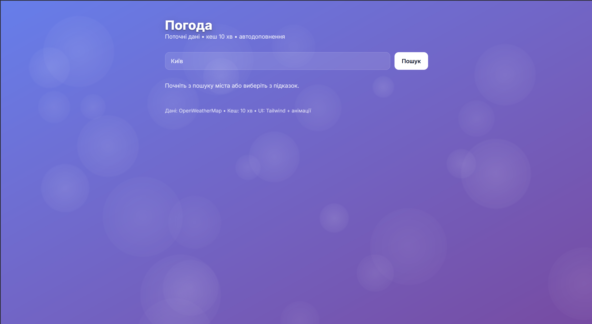
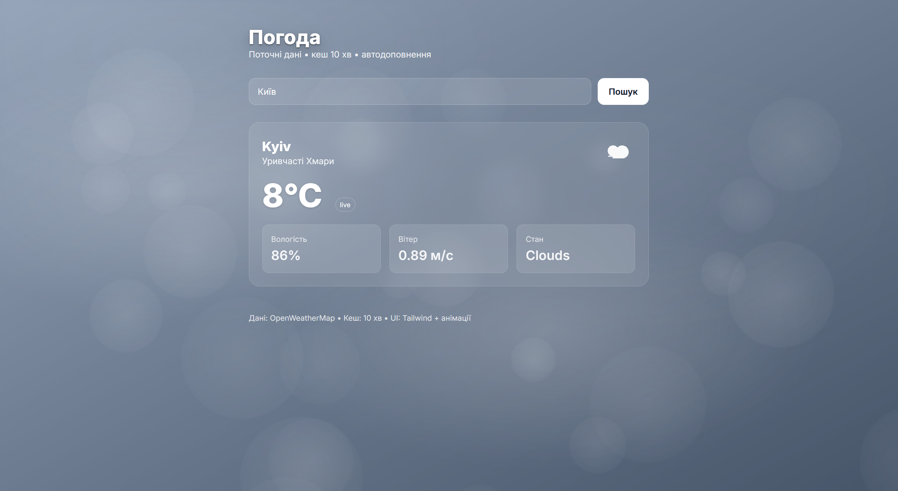
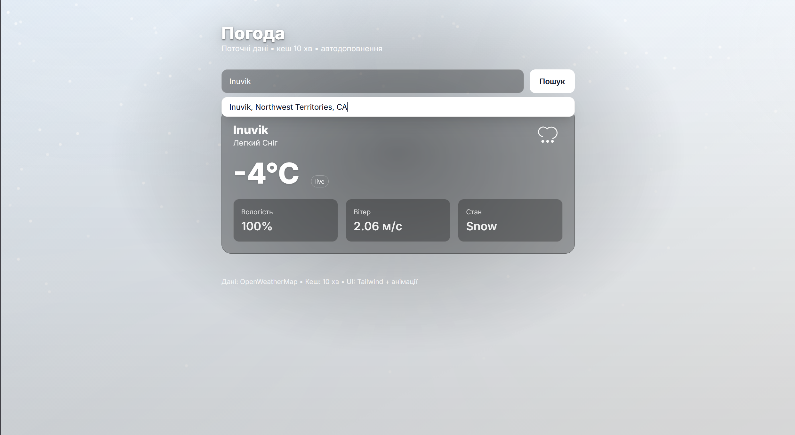
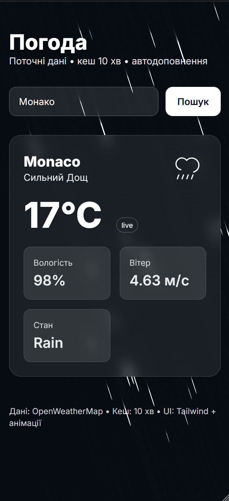

# 🌦️ Weather SPA (React + Node)

SPA для перегляду прогнозу погоди з автодоповненням міст, кешем (10 хв), резервним API та динамічними ефектами (сонце, дощ, сніг, туман, мороз, гроза).

---

## 🚀 Технологічний стек

| Шар | Технології | Особливості |
|------|-------------|-------------|
| **Frontend** | React 18 · Vite · TailwindCSS | Canvas-анімації (RainFX, SnowFX, HeatHaze, Frost, Mist), toast-повідомлення, адаптивна верстка |
| **Backend** | Node.js · Express · Axios · NodeCache | Primary API: OpenWeatherMap, fallback — Open-Meteo, єдиний формат JSON-помилок |
| **DevOps** | npm · dotenv · nodemon | Кешування результатів 10 хв, локальний запуск із `.env` |

# Weather SPA — Screenshots

## 🌤️ Головна сторінка


## ☁️ Хмарно


## ❄️ Сніг


## 🌧️ Адаптив + Дощ



---

## ⚙️ Швидкий старт

```bash
# 1️⃣ Клонувати проєкт
git clone https://github.com/USER/weather-spa.git
cd weather-spa

# 2️⃣ Сервер
cp .env.example server/.env
# встав свій OpenWeatherMap API ключ

cd server
npm install
npm run dev   # http://localhost:5000

# 3️⃣ Клієнт
cd ../client
npm install
npm run dev   # http://localhost:5173
